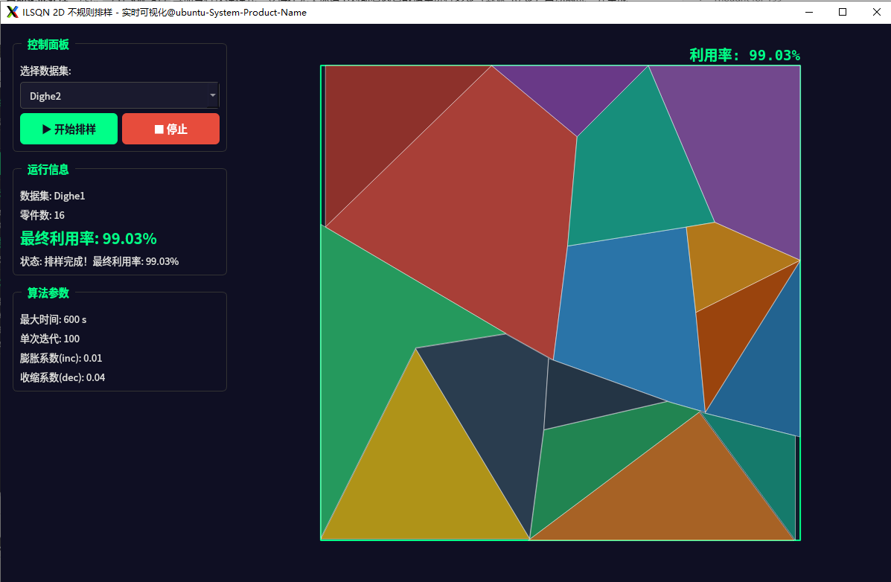
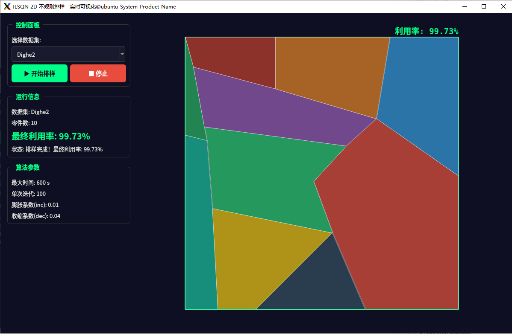
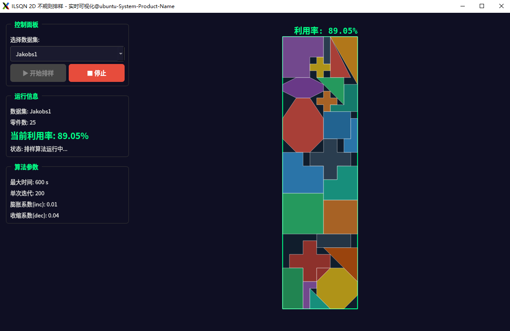
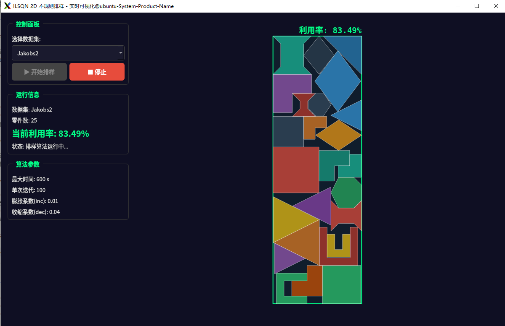

# 2D Irregular Packing (ILSQN)

本项目是一个基于非线性规划与迭代局部搜索算法（ILSQN）的二维不规则排样算法工程实现。系统主要用于解决工业生产中的二维排料问题（2D Irregular Strip Packing Problem），通过优化排样布局，最大化材料利用率。

## 系统特性

### 1. 核心算法基础

算法主体基于迭代局部搜索（Iterated Local Search, ILS）框架，内部嵌套 L-BFGS 非线性优化器进行局部重叠最小化（Overlap Minimization）。通过交替执行边界收缩与布局优化，逐步逼近最佳排样方案。

### 2. 精英保留模拟退火策略 (Elite-Preserving SA)

在 L-BFGS 的可行解评估阶段引入受控的模拟退火策略：

- **微扰容忍**：在迭代前期以设定概率接受微弱恶化（重叠量略微增加）的临时解，增强算法跳出局部最优的能力。
- **精英保留与回炉**：系统全局维护历史最优解（Elite Solution）。若连续多次迭代未能刷新最优记录，将自动回退至全局最佳状态重新开始下探。

### 3. "破坏与重建" 宏观扰动 (Ruins and Recreate)

针对超过 50 个零件的大规模排样场景，引入冲突驱动的组合扰动策略：优先移除边界惩罚或零件间重叠贡献最高的零件，并保留少量随机扰动，再按序贪心复插，由此解决密集排布下的整体连带干涉问题。

### 4. Qt5 可视化与批量集采

- **Qt5 可视化界面**：集成跨平台 Qt5 GUI，利用工作线程与信号槽机制实现排样过程中的无阻塞实时界面渲染，支持动态监测当前迭代轮次、参数及利用率。
- **自动化批处理**：提供 `./ILSQN all` 等命令行快捷模式，支持在无头环境下对所有内置数据集进行多轮（默认 10 轮）自动测试，并生成含有均值、极值与方差统计结果的 `result.csv`。

### 5. 排样结果示例

      

---

## 依赖库

- **Boost**（>= 1.71）：负责计算几何与多边形布尔运算的底层支持。
- **Eigen3**：提供 L-BFGS 内部大规模矩阵与向量运算。
- **Qt5 Widgets**：构建跨平台图形用户界面（可选）。

## 构建与执行流程 (Linux / WSL)

本项目使用 CMake 构建，通过宏 `BUILD_QT_GUI` 区分命令行版与可视化版。

```bash
# 1. 安装基础依赖
sudo apt-get install libboost-all-dev libeigen3-dev qtbase5-dev

# 2. 建立构建目录
mkdir build && cd build  

# 3. 编译与运行命令行版本
cmake .. -DCMAKE_BUILD_TYPE=Release
make -j$(nproc)
./ILSQN all        # 对全部数据集进行自动化基准测试
./ILSQN Jakobs1    # 指定单数据集演示
./ILSQN all --seed 42     # 固定随机种子，生成可复现的 result.csv
./ILSQN Shirts --seed 42  # 固定随机种子运行单数据集

# 4. 编译与运行 Qt 可视化版本
cmake .. -DCMAKE_BUILD_TYPE=Release -DBUILD_QT_GUI=ON
make -j$(nproc)
./ILSQN_GUI        # 启动可视化窗口界面
```

---

## 可选调参项

参数文件除原有字段外，可加入以下可选字段：

- `candidateSampleLimit`：候选点采样下限，默认 `800`，实际上限按 `min(8000, max(candidateSampleLimit, numPieces * 120))` 自适应。
- `largeInstanceThreshold`：大规模实例阈值，默认 `50`。
- `ruinRatio`：大规模实例每次破坏重建的零件比例，默认 `0.20`。
- `conflictRuinRatio`：破坏集合中来自高冲突零件的比例，默认 `0.70`。
- `minLargeIterations` / `minVeryLargeIterations`：大规模实例最低迭代数，默认分别为 `300` / `500`。
- `parallelCost`：L-BFGS cost/gradient 的 OpenMP 并行开关，默认 `0`。固定 seed 基准建议保持默认串行，以获得更稳定的复现结果。

---

## 目录结构说明

- `parameters/`：存储各工业数据集的实验参数配置。
- `data/Han.txt`：当前仓库保留的原始数据文件，但没有对应 `parameters/Han.txt`，不属于 `./ILSQN all` 当前 16 个基准数据集。
- `nfpsCache/`：存放预先生成的内靠接矩形（IFP）与临界多边形（NFP）的 `.csv` 几何边界缓存数据。
- `result.csv` / SVG 文件：算法运行结果统计及最终可视化矢量图输出目录。

## 参考文献与开源致谢

1. *An iterated local search algorithm based on nonlinear programming for the irregular strip packing problem*
2. **L-BFGS**: <https://github.com/ZJU-FAST-Lab/LBFGS-Lite>
3. **libnfporb**: <https://github.com/kallaballa/libnfporb>
4. **ClothCutting**: <https://github.com/zjl9959/ClothCutting>

> **Email**: <lilinfeng3983@163.com>
